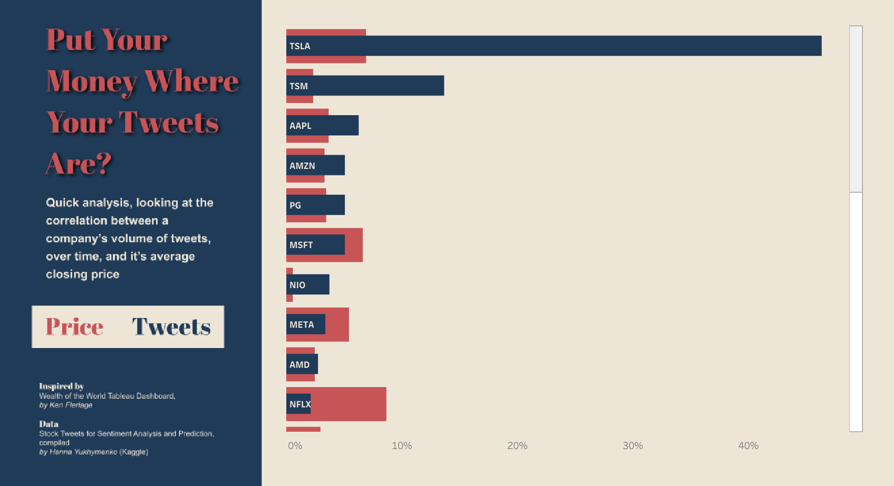
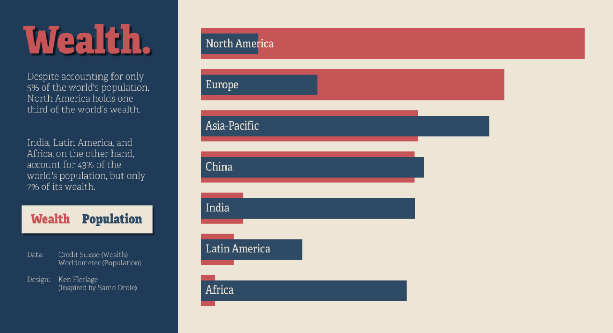

# Stock Ticker, Price to Tweet Volume Comparison
Tableau Dashboard Reconstruction | ***View on View on [Tableau](https://public.tableau.com/views/StockTweets/Dashboard1?:language=en-US&:display_count=n&:origin=viz_share_link)***

>Original 
[Wealth of the World](https://public.tableau.com/app/profile/ken.flerlage/viz/WealthoftheWorld/WealthvPopulation) Tableau Dashboard, by [Ken Flerlage](https://www.linkedin.com/in/kennethflerlage)

 
## About
I saw Ken Flerlage's [Wealth of the World](https://public.tableau.com/app/profile/ken.flerlage/viz/WealthoftheWorld/WealthvPopulation) Tableau dashboard and loved the design and how he visualized the comparison of two metrics to determine how closely they were related (*or not*). I wanted to make something similar, but with different data, using his layout and design as inspiration.

## Process
I knew I would need data with at least x1 categorical dimension and x2 continuous measures. I decided to use stock ticker data to answer the question of whether or not a ticker's volume of tweets correlated with its average closing price over time. 

Click here for a breakdown of steps

1. I found two ticker datasets on [Kaggle](https://www.kaggle.com/datasets/equinxx/stock-tweets-for-sentiment-analysis-and-prediction?select=stock_yfinance_data.csv), one with ticker tweets and the other with price data.
2. Each dataset was broken down by date and timestamp for each row. For the tweets, I aggregated them at the ticker level and got a count for the number of tweets, and then a % of total value. For the prices, I again aggregated at the ticker level and got the average price for each ticker and then a % of the total of the averages for each ticker.
3. After some other minor formatting, I uploaded the data to Tableau. I used Google sheets to re-create the original background graphic, using shapes and text boxes.
4. I created a dual axis bar chart in Tableau and added metadata to the tooltips to customize the hover view. I turned and formatted the label values to re-create the look of the original dashboard. The categories are included in the original graphic background, but for my categories I turned on and formatted Tableau's chart labels.

